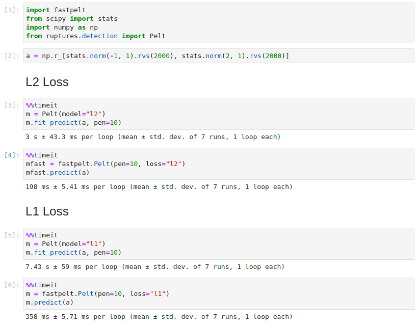

# Pruned Exact Linear Time
*written in rust*

Original [paper](https://arxiv.org/pdf/1101.1438.pdf). 

This is a port of the [ruptures](https://github.com/deepcharles/ruptures) Python project.

## Python

`pip install fastpelt`


```python
import fastpelt
mfast = fastpelt.Pelt(pen=10, loss="l1")
mfast.predict(a)
```

## Performance

